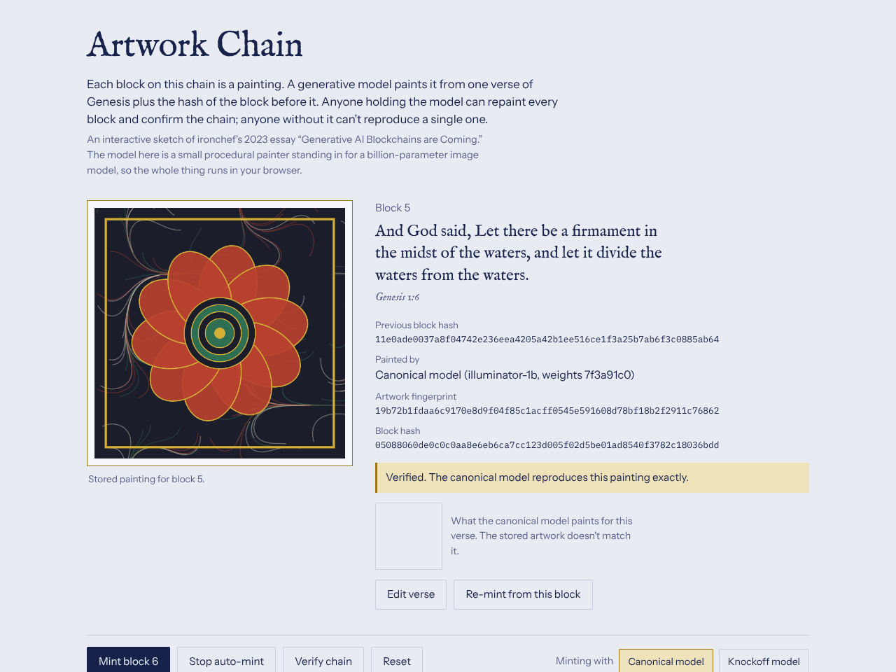

# Artwork Chain

[Open the demo](../demos/artwork-chain.html)

A chain of ten blocks, one per verse of Genesis 1 (KJV). Each block is a painting generated from its verse and the previous block's hash.

## Block structure

| Field | Contents |
|---|---|
| `height` | Position in the chain |
| `verse` | The prompt for this block |
| `prev` | Hash of the previous block (all zeros for genesis) |
| `model` | Which model painted it: canonical or knockoff |
| `fp` | Fingerprint: hash of the model's latent output |
| `hash` | `hash(height, prev, verse, fp)` |

The "model" is a deterministic procedural painter seeded by `weights | prev | verse`. It stands in for a real image model so the demo runs instantly.

## Things to try

- **Mint** blocks one at a time or with **Auto-mint**, and watch each painting denoise into place.
- **Verify chain** repaints every block with the canonical model and compares fingerprints. Verified blocks turn gold.
- **Edit a verse**, then verify. That block is rejected, and the panel shows what the canonical model paints for the new text. Every later block also fails, because its `prev` no longer matches.
- **Switch to the knockoff model** and re-mint. The paintings look equally plausible but none of them verify.

## What it demonstrates

Tamper-evidence comes from hash linking, as in any blockchain. The new part is that verification requires the exact model weights: the model acts as a key.
