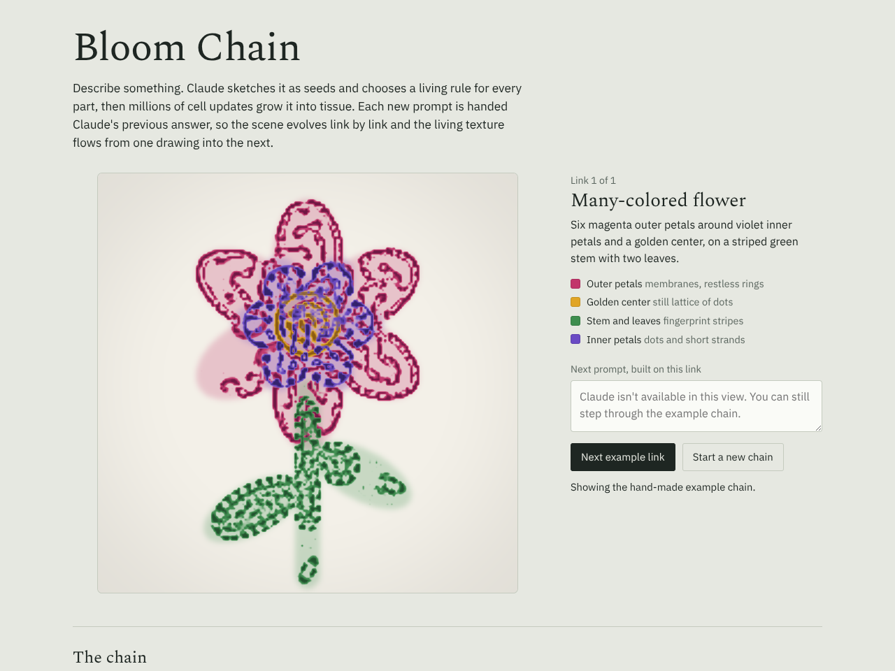

# Bloom Chain

[Open the demo](../demos/bloom-chain.html)

Type a prompt. Claude sketches it as shapes, divides it into up to four living tissues and picks a behavior for each. Cellular automata then grow the sketch into moving tissue. Every new prompt is sent along with Claude's previous response, so the scene evolves link by link.

## Pipeline

1. **Prompt → spec.** Claude returns JSON: a title, a one-sentence interpretation, a background color, up to four `species` (name, color, deep shade, behavior) and up to 30 `shapes` (`circle`, `ellipse`, `line`, `petals`, `polygon`) on a 100 × 100 canvas. It also suggests a `next` prompt.
2. **Spec → masks.** Each species' shapes are rasterized into its own channel of a 192 × 192 mask.
3. **Masks → life.** Four Lenia-style automata run at once, one per RGBA channel. A tissue can only live inside its own mask, so the drawing keeps its shape while its surface moves.
4. **Link → link.** On a new link the old and new masks cross-fade over about two seconds and the cells carry over rather than restarting.

Every link stores its prompt, Claude's response and a hash that includes the previous link's hash.

## Behaviors

Eight rules found by the Living Rules search: `membranes`, `dots`, `beads`, `maze`, `swarm`, `wash`, `clusters`, `stripes`.

## Running it

- **As a claude.ai artifact**, new links call Claude through the artifact runtime's `sample` capability, on the viewer's own Claude usage. The page asks permission on first use; each link takes roughly 10–40 seconds.
- **Opened anywhere else** (GitHub Pages, a local server), there is no Claude access. The page steps through a built-in three-link example: a many-colored flower, then bees arriving, then the flower going to seed.

Claude's response is validated before use: unknown behaviors, malformed colors and bad shapes are replaced or dropped, and coordinates are clamped.

## Tips

Bold, large shapes come alive best. Parts thinner than about 5 units (stems, tentacles) render as faint colored sketches, because living texture needs room to form.
