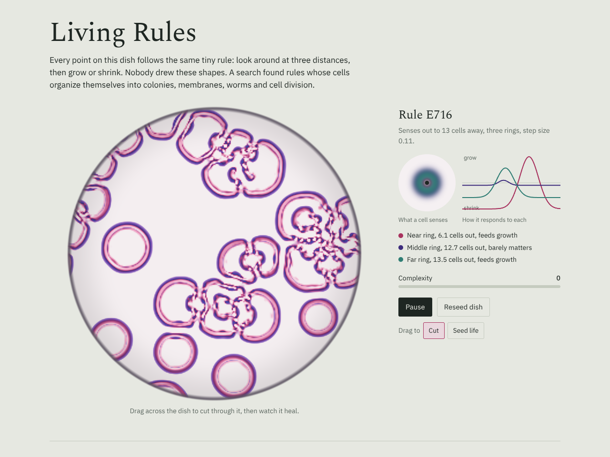

# Living Rules

[Open the demo](../demos/living-rules.html)

Continuous cellular automata, rendered like stained tissue, with an evolutionary search that finds rules that come alive. Runs on the GPU via WebGL 2.

## The rule

Every cell holds a value from 0 to 1. Each step, it:

1. Measures the average life in three rings around it (near, middle, far). Each ring is a kernel with radius `r`, peak position `c` and width `w`.
2. Passes each reading `U` through a growth curve `h · (2·exp(−(U−m)² / 2s²) − 1)`, which pushes up when the reading is near `m` and down otherwise.
3. Adds `dt` times the sum and clamps to [0, 1].

A rule is therefore 19 numbers: `dt` plus `r, c, w, m, s, h` for each of three kernels. This is the Lenia family (Bert Wang-Chak Chan). Structurally it is a one-layer network shared by every cell. Kernels are applied with a 2×2 block-sampled approximation that alternates phase each step, which keeps large radii fast on the GPU.

## The search

Eight rules run side by side. Every seven seconds the three with the lowest complexity score are replaced by mutated offspring (and crossovers) of the top four. Dead dishes are replaced early.

The **complexity score** is a heuristic computed from a 32×32 downsample: it rewards variance, sustained motion, and structure that survives at a coarser scale, and penalizes dishes that die out, fill up, or boil into noise. It is a small evolutionary search, not a trained model.

The starting population came from an offline search over a few hundred random rules, so the page opens on interesting behavior.

## Controls

- **Drag to Cut** erases tissue; watch it heal. **Seed life** sprinkles noise for the rule to organize.
- Tap any small dish to load its rule into the large one.
- **Start from random rules** resets the population; most die, and the search recovers within a few generations.
