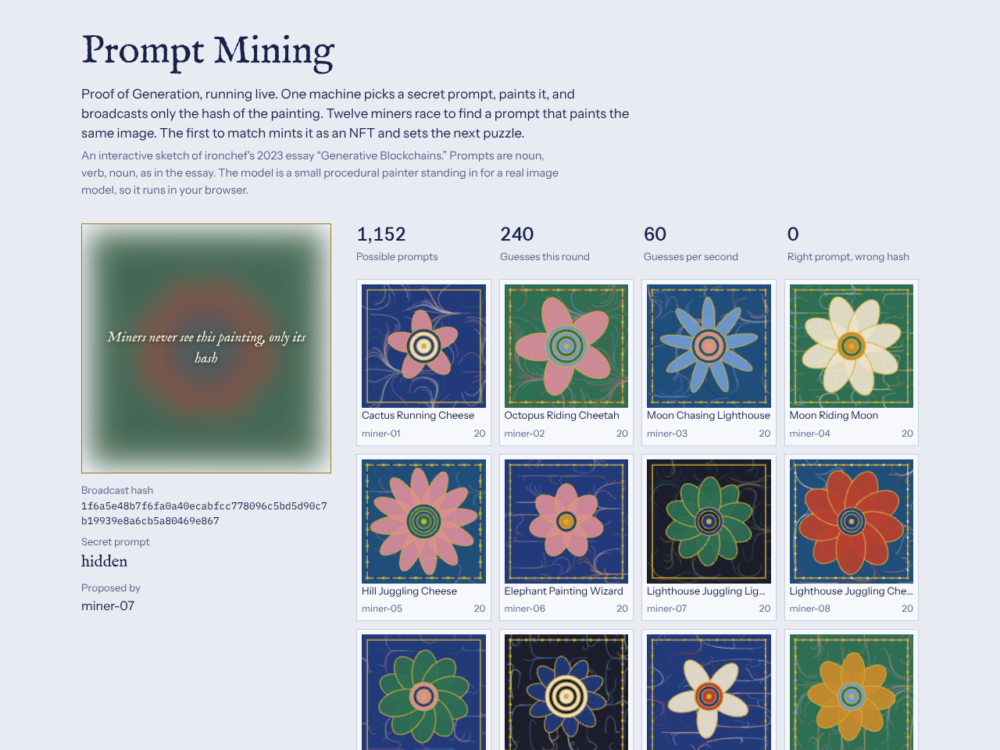

# Prompt Mining

[Open the demo](../demos/prompt-mining.html)

A live version of Proof of Generation from the essay *Generative Blockchains*.

## How a round works

1. A proposer rolls a secret noun-verb-noun prompt (12 × 8 × 12 = 1,152 possibilities), paints it, and broadcasts only the painting's hash. The target painting stays blurred.
2. Twelve miners generate paintings from random prompts and hash each one. Their tiles show every guess in real time.
3. The first miner whose hash matches wins. The prompt and painting are revealed, the painting is minted as an NFT, and the winner proposes the next round.

## The noise toggle

- **Deterministic**: the same prompt always produces the same bytes, so the right guess always wins.
- **Noisy, like real models**: each render adds small sampling variation. A miner can guess the right prompt and still miss the hash. The *Right prompt, wrong hash* counter climbs and rounds never resolve.

This is the essay's own "Is this secure? No" section, shown rather than described. A working network would need fixed seeds, samplers and numeric precision across all hardware.
