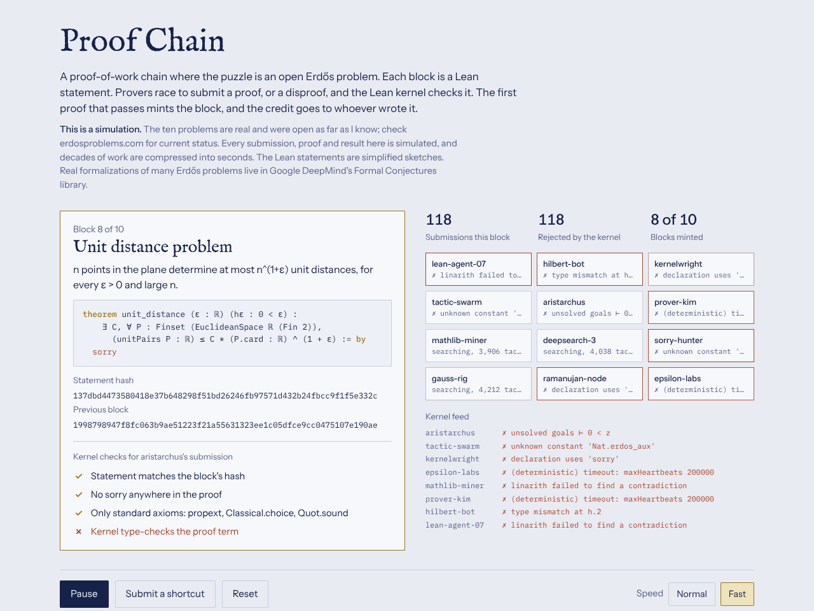

# Proof Chain (Challenge Vaults)

[Open the demo](../demos/proof-chain.html)

A chain whose puzzles are open Erdős problems stated in Lean. Provers race to submit a proof or disproof; the first one the kernel accepts mints the block and earns the credit.

> **Simulation only.** The ten problems are real and were open when this was built; check [erdosproblems.com](https://www.erdosproblems.com) for current status. Every submission, proof and result is simulated, and minted blocks are labeled "simulated result". The Lean statements are simplified sketches; real formalizations live in Google DeepMind's [Formal Conjectures](https://github.com/google-deepmind/formal-conjectures) library.

## The problems

Erdős–Straus, Erdős–Moser, Erdős–Gyárfás, Erdős–Turán on additive bases, Erdős on arithmetic progressions, the odd covering problem, Erdős–Ulam, the happy ending problem, the unit distance problem, and Erdős–Hajnal.

## The four kernel checks

1. The statement matches the block's locked statement hash.
2. No `sorry` anywhere in the proof.
3. Only the standard axioms: `propext`, `Classical.choice`, `Quot.sound`.
4. The kernel type-checks the proof term.

## Things to try

- **Start mining** and watch the kernel feed: nearly every submission fails with a realistic Lean error.
- **Submit a shortcut** cycles through three cheats, each rejected at a specific check: a proof ending in `sorry`, a proof that adds its own axiom, and a proof of an easier special case.
- The **Credit** board tracks which prover minted which blocks.

## Design notes

Lean fixes the determinism problem of the art chains: verification is exact. It does not make open problems a proof-of-work puzzle, because difficulty cannot be scheduled. See [concepts.md](concepts.md#3-challenge-vaults-and-the-proof-chain) for the vault design (commit-reveal, challenge windows, difficulty ladder).
