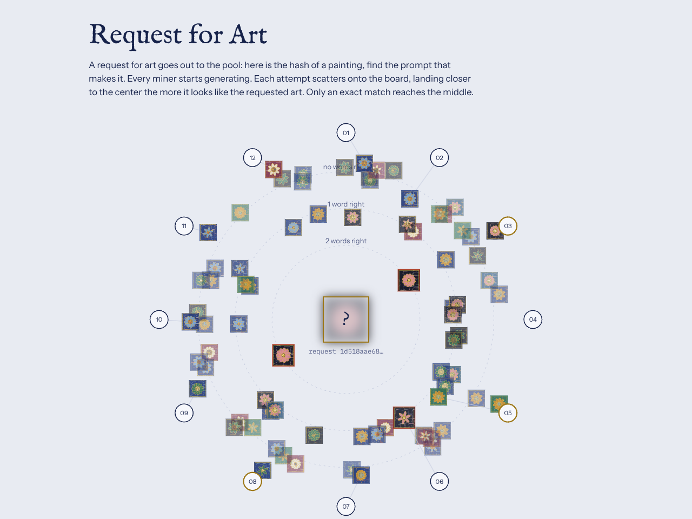

# Request for Art

[Open the demo](../demos/request-for-art.html)

The mining race drawn as a dartboard. A hidden "request for art" sits in the center; twelve miners sit on the outer ring.

## What you see

1. **Broadcast**: gold pulses carry the request's hash out to the miners.
2. **Scatter**: each attempt flies inward as a small painting. Where it lands depends on how many of the three prompt words it gets right:
   - outer band: none
   - middle band: one
   - inner band (red outline): two
3. **Solve**: only the exact prompt reproduces the hash. That painting flies to the center, the request is revealed and minted, and a new request goes out.

Each prompt word controls one visual layer (first noun: palette; verb: shapes; second noun: center and border), so near-misses really do look close.

## The point to keep straight

The rings measure visual similarity, not closeness of the hash. A hash gives no partial credit, so a near-miss is still a miss. Viewers can watch the art converge, but the chain only accepts the exact answer.

Controls: **Pause**, **New request**, and **Normal / Fast** speed.
